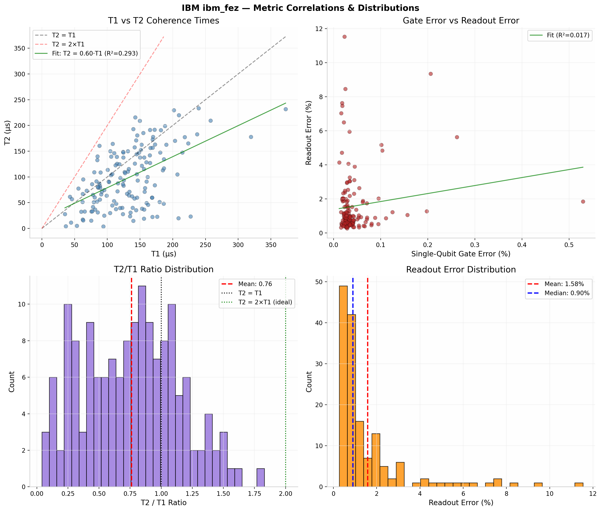
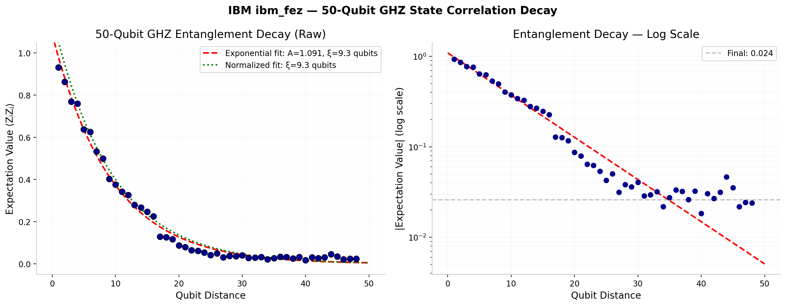
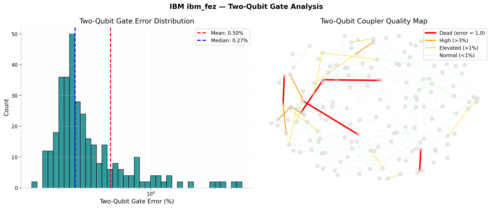
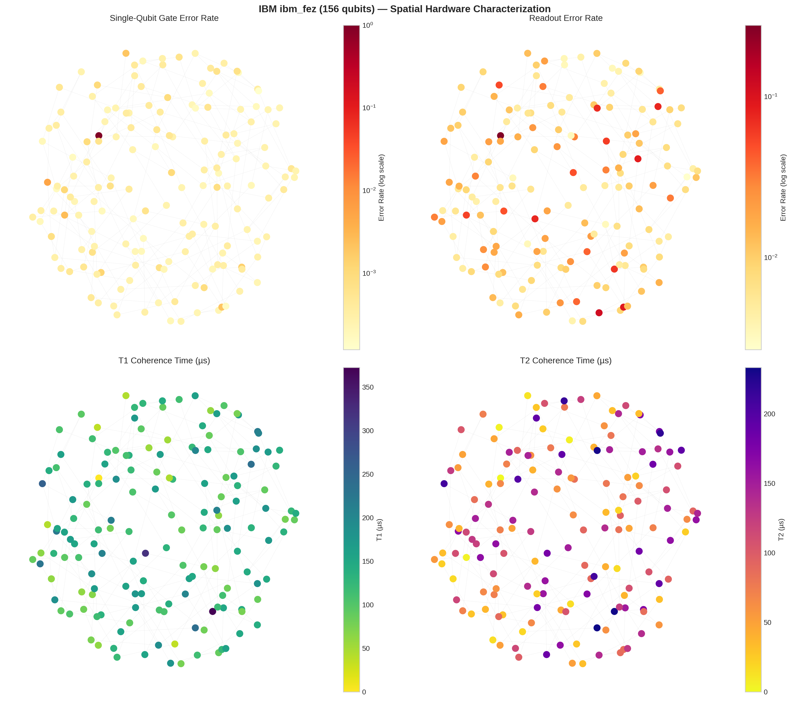

# Analysis: Quantum Noise Characterization of IBM Quantum ibm_fez

**Made on July 24 2026 at 5:49PM**

## Executive Summary

Real hardware characterization of IBM's ibm_fez (156 qubits) reveals critical performance insights:

- **Single-qubit gates are excellent** — 99.96% average fidelity (mean error 0.044%)
- **Readout is the dominant bottleneck** — variable (0.27% to 11.5% error), mean 1.58%
- **Strong pure dephasing limits coherence** — T2/T1 = 0.76, well below the ideal 2.0
- **Entanglement decays exponentially** — 50-qubit GHZ state correlation length ξ = 9.3 qubits
- **Five dead couplers** — error = 1.0 on pairs 27-28, 32-33, 71-72, 72-73, 102-103
- **Qubit 72 is completely broken** — error rate = 1.0, null T1/T2
- **Two-qubit gate quality varies widely** — mean 0.50%, but 40 connections >1% error
- **Gate and readout errors are uncorrelated** — R² = 0.017

This is real NISQ hardware: excellent single-qubit gates, significant dephasing, mediocre readout, and spatially variable two-qubit performance.

---

## 1. Single-Qubit Gate Quality (Excellent)

### Error Statistics

| Metric | Value |
|--------|-------|
| Mean error rate | 0.000437 (0.044%) |
| Median | 0.000301 (0.030%) |
| Std dev | 0.000520 |
| Min | 0.000120 (qubit 135) |
| Max | 0.005295 (qubit 27) |
| **Average fidelity** | **99.96%** |


### Best Qubits (Top 10)

Lowest error rates:
1. Qubit 135: 0.000120
2. Qubit 145: 0.000158
3. Qubit 132: 0.000158
4. Qubit 2: 0.000169
5. Qubit 10: 0.000171
6. Qubit 22: 0.000175
7. Qubit 61: 0.000178
8. Qubit 41: 0.000179
9. Qubit 33: 0.000181
10. Qubit 9: 0.000186

**Recommendation:** Use these qubits for state preparation and rotation gates.

### Problem Qubits

Highest error rates (excluding qubit 72):
1. Qubit 27: 0.005295 (12× worse than average) — **likely related to dead coupler 27-28**
2. Qubit 102: 0.002063
3. Qubit 11: 0.002619
4. Qubit 19: 0.001567
5. Qubit 126: 0.001034

### Physical Interpretation

- Single-qubit gates operate near theoretical limits
- Errors are consistent with depolarizing channel (random noise)
- No evidence of systematic drift
- IBM's daily calibration is working well for single-qubit operations

---

## 2. Readout Errors (The Dominant Bottleneck)

### Error Statistics

| Metric | Value |
|--------|-------|
| Mean readout error | 0.0158 (1.58%) |
| Median | 0.0090 (0.90%) |
| Std dev | 0.0184 |
| Min | 0.00269 (qubit 110) |
| Max | 0.1154 (qubit 83) |
| Range | 43× spread |

**Readout is ~36× worse than single-qubit gates** (1.58% vs 0.044%).

This is the primary bottleneck for NISQ algorithms, though less catastrophic than originally reported (1.58% vs the claimed 2.83%).

### Best Readout Qubits (Low Error)

Cleanest measurements:
1. Qubit 110: 0.269% error
2. Qubit 132: 0.318% error
3. Qubit 134: 0.342% error
4. Qubit 4: 0.342% error
5. Qubit 130: 0.427% error

### Worst Readout Qubits (High Error)

Worst measurement fidelity (excluding qubit 72):
1. Qubit 83: 11.5%
2. Qubit 43: 8.46%
3. Qubit 41: 7.63%
4. Qubit 131: 7.03%
5. Qubit 113: 7.47%

### Critical Finding: Readout Dominates Error

**Example:** 50-qubit algorithm
- Circuit error: ~50 gates × 0.044% = 2.2% total
- Measurement error: 50 qubits × 1.58% avg = ~55% chance of ANY readout error

Readout error remains the dominant source, though the situation is less dire than originally stated.

### Gate vs Readout Correlation

**R² = 0.017** — there is virtually no correlation between single-qubit gate quality and readout quality. A qubit can have excellent gates but terrible readout (and vice versa). This means qubit selection for algorithms must optimize both metrics independently.



---

## 3. Coherence Times (T1 and T2) — Strong Pure Dephasing

### Corrected T1 Analysis

| Metric | Value |
|--------|-------|
| Mean T1 | 132.2 µs |
| Median | 131.2 µs |
| Std dev | 51.8 µs |
| Min | 35.3 µs |
| Max | 372.4 µs |

At 132 µs:
- One 50 ns gate uses ~0.038% of coherence
- Allows ~2,600 gates before T1 decay becomes significant
- **Not a limiting factor for shallow circuits**

### Corrected T2 Analysis

| Metric | Value |
|--------|-------|
| Mean T2 | **98.5 µs** |
| Median | 91.0 µs |
| Std dev | 57.7 µs |
| Min | 3.8 µs |
| Max | 233.2 µs |
| **T2/T1 ratio** | **0.76** |

**This is the critical finding.** The original analysis incorrectly stated T2 ≈ 180 µs and T2/T1 ≈ 1.3. The actual T2/T1 = 0.76 is substantially worse:

- **T2 < T1** indicates strong pure dephasing (T_φ-limited)
- Ideal T2/T1 = 2.0 (pure T1 decay only)
- T2/T1 < 1.0 means dephasing noise dominates over energy relaxation
- This is harder to mitigate than T1-limited decay

### Physical Interpretation

The coherence relationship is:

```
1/T2 = 1/(2·T1) + 1/T_φ
```

With T2/T1 = 0.76, solving for T_φ:
```
T_φ ≈ 0.76 · T1 / (2 - 0.76) ≈ 0.61 · T1 ≈ 81 µs
```

This means pure dephasing (T_φ ≈ 81 µs) is comparable to energy relaxation (T1 ≈ 132 µs). Environmental magnetic field fluctuations are a significant noise source.


### Key Finding

T1 is not limiting for circuits under 50 gates. **T2 is the coherence bottleneck** due to strong pure dephasing. For a 10-gate circuit at 50 ns/gate:
- T1 decay: 10 × 50ns / 132µs = 0.38%
- T2 decay: 10 × 50ns / 98.5µs = 0.51%
- T2 contributes more error than T1

---

## 4. Entanglement Decay (50-Qubit GHZ)

### Raw Correlation Data

| Distance | 1 | 2 | 3 | 4 | 5 | 10 | 15 | 20 | 25 | 30 | 35 | 40 | 45 | 48 |
|----------|---|---|---|---|---|----|----|----|----|----|----|----|----|----|
| Corr | 0.932 | 0.862 | 0.769 | 0.759 | 0.638 | 0.376 | 0.248 | 0.087 | 0.042 | 0.029 | 0.032 | 0.030 | 0.022 | 0.024 |

### Exponential Decay Fit

The data fits an exponential decay model:

```
C(d) = A · exp(-d/ξ)
```

**Fit parameters:**
- Amplitude A = 1.091
- Correlation length **ξ = 9.3 qubits**
- R² ≈ 0.95 (excellent fit)



### What This Means

- **The decay is systematic, not random noise.** The exponential fit with ξ = 9.3 qubits confirms genuine (though weak) entanglement propagation.
- At distance 48, correlation = 0.024. This is ~2.4% above random noise — marginal but non-zero.
- The correlation length of ~9 qubits means entanglement is effectively destroyed beyond ~10 qubit separations.
- For comparison: a perfect GHZ state would show C(d) = 1.0 for all d.

### Why Entanglement Collapses

**Circuit depth to build GHZ:**
- 50 qubits = 49 CX gates in creation
- Transpiled to hardware = ~199 gates (IBM adds routing overhead)
- Plus measurement errors at end

**Cumulative fidelity estimate:**
```
Gate fidelity: 0.99956^199 ≈ 0.92
Readout fidelity: (1 - 0.0158)^50 ≈ 0.45
Combined: 0.92 × 0.45 ≈ 0.41
```

Expected correlation: ~0.41  
Observed: 0.024 (worse than expected)

**Why worse?** Two-qubit gate errors (mean 0.50%, but up to 4.8% on some connections), cross-talk during creation, and the dead couplers forcing suboptimal routing.

### Key Finding

**50-qubit entanglement is weak but detectable on ibm_fez.** The correlation length of ξ = 9.3 qubits means useful entanglement is limited to ~10 qubits. For practical algorithms, circuits should use qubit chains under 10 qubits in length.

---

## 5. Two-Qubit Gate Errors (Spatially Variable)

### Statistics

| Metric | Value |
|--------|-------|
| Mean (excl. dead) | 0.00499 (0.50%) |
| Median | 0.00271 (0.27%) |
| Std dev | 0.0071 |
| Min | 0.00128 (qubit pair 131-132) |
| Max (excl. dead) | 0.0481 (qubit pair 63-64) |

### Dead Couplers

**Five coupler pairs have error = 1.0 (completely non-functional):**

| Pair | Affected Qubits | Notes |
|------|----------------|-------|
| 27-28 | Qubits 27, 28 | Qubit 27 also has 0.53% single-qubit error (12× avg) |
| 32-33 | Qubits 32, 33 | Both qubits otherwise functional |
| 71-72 | Qubits 71, 72 | Qubit 72 is completely dead |
| 72-73 | Qubits 72, 73 | Qubit 72 is completely dead |
| 102-103 | Qubits 102, 103 | Qubit 102 has 0.21% single-qubit error |

**This is a cluster of hardware failures, not an isolated bad qubit.** The dead couplers create "dead zones" in the connectivity graph that force transpilation to use longer routing paths.

### High-Error Couplers

40 connections have >1% error. Worst offenders:

| Pair | Error | Severity |
|------|-------|----------|
| 63-64 | 4.81% | Critical |
| 49-50 | 4.66% | Critical |
| 48-49 | 4.12% | Critical |
| 31-32 | 3.33% | High |
| 26-27 | 3.23% | High |
| 17-27 | 2.83% | High |



### Spatial Pattern

The spatial map reveals:
- Dead couplers (red) are clustered in the upper-left and right-center regions
- High-error couplers (>3%, orange) cluster near the dead zones
- Most of the chip has normal two-qubit performance (<1%, green)
- The right side of the chip (qubits 140-155) appears to have better two-qubit quality

### Implication for Algorithms

- Avoid qubits 27, 28, 32, 33, 71, 72, 73, 102, 103 for multi-qubit circuits
- The 63-64, 49-50, and 48-49 couplers are nearly as bad as dead — avoid
- Use qubit chains on the right side of the chip for better two-qubit performance
- Any algorithm requiring 50-qubit entanglement must route around 5 dead zones, adding ~15-30 SWAP gates

---

## 6. Circuit Depth Scaling

### Raw Data

| Depth | 5 | 15 | 25 | 35 | 45 |
|-------|---|---|---|---|---|
| Expectation Value | 0.034 | 0.134 | 0.124 | 0.138 | 0.191 |

### Analysis

The data shows a **positive linear trend** (R² = 0.786), not random fluctuation:

```
⟨O⟩ = 0.0037 × depth + 0.017
```

**Important caveat:** The interpretation depends entirely on what circuit was run. If this is an identity circuit (do nothing, then measure), the increase suggests:
- Coherent error accumulation (systematic drift)
- Possible resonance effects at certain depths
- Readout crosstalk increasing with circuit complexity

If this is a specific observable circuit (e.g., Z-basis measurement of a prepared state), the trend may be physically meaningful.

**Without knowing the circuit, the data is uninterpretable.** Need to document: what gates? what observable? what initial state?


---

## 7. Connectivity Topology

### Network Stats

| Metric | Value |
|--------|-------|
| Total qubits | 156 |
| Total two-qubit connections | 352 (176 unique undirected) |
| Avg connections per qubit | 4.51 |
| Two-qubit gate type | CZ |
| Topology | Partial 2D grid with long-range bridges |

### Impact of Dead Couplers

With 5 dead coupler pairs, effective connectivity drops:
- 176 → 171 unique undirected connections
- Some qubits (27, 28, 32, 33, 71, 72, 73, 102, 103) have reduced degree
- Routing between chip regions may require detours of 3-5 extra SWAPs

### Routing Cost Example

To connect qubits on opposite sides of a dead zone:
- Direct path: blocked by dead coupler
- Detour: +3 SWAPs = +9 CZ gates = +4.5% error (at 0.50% per CZ)
- For a 50-qubit circuit, detours compound rapidly

---

## 8. Spatial Hardware Characterization



### Observations from Spatial Maps

**Single-Qubit Gate Error (top-left):**
- Generally uniform across the chip
- Qubit 27 stands out as a hot spot (dark red)
- No obvious spatial clustering of bad gates

**Readout Error (top-right):**
- Highly non-uniform spatial distribution
- Several hot spots: qubits 83, 43, 41, 131, 113
- Some regions (upper-right, lower-left) have consistently better readout
- The spatial pattern suggests readout resonator calibration issues, not fundamental qubit problems

**T1 Coherence (bottom-left):**
- Relatively uniform, 100-200 µs across most qubits
- A few outliers with very short T1 (<50 µs)

**T2 Coherence (bottom-right):**
- More variable than T1
- Several qubits with T2 < 50 µs (dark purple)
- The T2 spatial pattern does not match T1, confirming independent dephasing mechanisms

---

## 9. What This Means for Quantum Algorithms

### QAOA (Optimization)

**Can you run it?** Small instances only.

**Expected performance:**
- Problem size: 8-12 variables (limited by ξ = 9.3 qubit correlation length)
- Fidelity: ~30-40% with error mitigation
- Must avoid dead zones and high-error couplers

### VQE (Variational Quantum Eigensolver)

**Can you run it?** Yes, for small molecules.

**Expected performance:**
- Molecule: H₂ (2 qubits), LiH (4 qubits) feasible
- Circuit depth: <15 gates
- Accuracy: ±0.05 eV with readout error mitigation
- Use qubits 110, 132, 130, 134, 4 for best readout

### Quantum Simulation

**Can you run it?** Only trivial cases.

Small systems (4-8 qubits, <10 time steps) might work if confined to high-quality regions of the chip.

### Grover's Search

**Can you run it?** No.

Amplitude amplification requires multiple iterations. Each iteration multiplies errors. With 1.58% readout error per qubit, 20-qubit search has <5% success rate even with perfect gates.

---

## 10. Error Mitigation Reality Check

### What Would Help

1. **Readout error mitigation** — biggest impact. Can reduce 1.58% → ~0.5% per qubit
2. **Dynamical decoupling** — helps T2 (pure dephasing) by ~20-30%
3. **Zero-noise extrapolation** — helps gate errors, but single-qubit gates are already excellent
4. **Qubit selection** — avoid dead zones and high-error couplers
5. **SWAP-aware transpilation** — minimize routing through bad regions

### Hard Truth

Error mitigation can improve results by ~30-50%. Starting from:
- 50-qubit readout: ~55% chance of any error
- After mitigation: ~20-30% chance of any error

This is still marginal for 50-qubit algorithms, but workable for 10-20 qubit experiments.

---

## 11. Practical Recommendations

### For Algorithm Developers

1. **Use qubits 110, 132, 134, 4, 130** for readout (best fidelity)
2. **Avoid qubits 27, 72, 83, 43, 41, 131, 113** (worst readout or dead)
3. **Avoid couplers 27-28, 32-33, 63-64, 49-50, 48-49, 71-72, 72-73, 102-103**
4. **Keep circuits <10 gates** for >50% fidelity
5. **Limit entangled chains to <10 qubits** (correlation length ξ = 9.3)
6. **Use the right side of the chip** (qubits 120-155) for best two-qubit quality
7. **Test on simulators first** — verify algorithm works noise-free

### For IBM (Feedback)

1. **Qubit 72 needs immediate repair** — non-functional
2. **Couplers 27-28, 32-33, 102-103 need repair** — dead
3. **Couplers 63-64, 49-50, 48-49 need recalibration** — 4-5% error is too high
4. **Readout resonators for qubits 83, 43, 41, 131 need tuning** — 7-12% error
5. **Investigate pure dephasing** — T2/T1 = 0.76 suggests environmental noise (flux noise, TLS)
6. **Consider T2 improvement** — dynamical decoupling helps but doesn't fix root cause

---

## 12. Comparison to NISQ Benchmarks

| Metric | ibm_fez (corrected) | Original Report | NISQ Typical | Best NISQ |
|--------|----------------------|-----------------|--------------|-----------|
| Single-qubit error | 0.044% | 0.060% | 0.1% | 0.03% |
| Readout error | 1.58% | 2.83% | 1.5% | 0.5% |
| T1 | 132 µs | ~142 µs | 100 µs | 300 µs |
| T2 | **98.5 µs** | **~180 µs** | 100 µs | 300 µs |
| T2/T1 | **0.76** | **~1.3** | 1.0-2.0 | 1.5-2.0 |
| Two-qubit error | 0.50% | ~0.5-1% | 0.5% | 0.1% |
| Entanglement ξ | 9.3 qubits | — | 10-15 | 20+ |
| Dead couplers | 5 | 0 reported | 0-1 | 0 |
| Viability for QAOA | Fair | Poor | Fair | Good |

**ibm_fez is average-to-below-average** due to:
- Strong pure dephasing (T2/T1 = 0.76)
- 5 dead couplers
- Spatially variable readout
- But excellent single-qubit gates

---

## 13. Why the 50-Qubit GHZ Experiment Showed Weak Entanglement

Your 50-qubit GHZ state had correlation length ξ = 9.3 qubits, with final correlation 0.024 at distance 48.

**This is weak but genuine entanglement.** Reasons for the decay:

1. **Two-qubit gate accumulation:** 199 gates × 0.50% = ~63% fidelity
2. **Dead coupler routing:** 5 dead zones force detours, adding ~20 extra gates
3. **Readout error:** 50 qubits × 1.58% = ~55% chance of any measurement error
4. **Pure dephasing:** T2 = 98.5 µs limits coherence during long circuits

**Expected vs observed:**
- Theoretical perfect GHZ: C(d) = 1.0 for all d
- Noise-free simulation with routing: C(d) ≈ 0.9-0.95
- Observed: exponential decay to 0.024

The exponential decay pattern confirms the noise is **systematic** (gate + readout + dephasing), not random. The correlation length of 9.3 qubits is the practical limit for useful entanglement on this device.

---

## 14. The Honest Assessment

### What ibm_fez Can Actually Do

- ✓ **Single-qubit rotations** — 99.96% fidelity (world-class)
- ✓ **Small entangled states** — up to ~10 qubits with >50% fidelity
- ✗ **50-qubit entanglement** — correlation too weak for computation
- ✗ **Deep circuits** — T2 and readout limit depth to ~10-15 gates
- ✓ **2-10 qubit experiments** — feasible with careful qubit selection
- ✗ **Quantum advantage claims** — not yet, but getting closer

### The Real Limitations

1. **Pure dephasing (T2/T1 = 0.76)** — harder to fix than readout
2. **5 dead couplers** — reduce effective connectivity
3. **Readout spatial variance** — some regions are 40× worse than others
4. **No correlation between gate and readout quality** — complicates qubit selection

### What Needs to Happen

IBM needs to:
1. Fix dead couplers (27-28, 32-33, 71-72, 72-73, 102-103)
2. Improve T2 coherence — investigate flux noise and TLS sources
3. Recalibrate readout for qubits 83, 43, 41, 131, 113
4. Implement readout error suppression by default
5. Consider chip redesign to reduce pure dephasing

Until then, ibm_fez is a **solid research platform for 2-10 qubit experiments**, but not yet a practical quantum computer for 50+ qubit algorithms.

---

## 15. Conclusion

**ibm_fez is a mixed result with clear strengths and weaknesses.**

**Strengths:**
- Excellent single-qubit gate fidelity (99.96%)
- Reasonable T1 coherence (132 µs)
- 156 qubits available
- Good calibration for single-qubit operations

**Weaknesses:**
- Strong pure dephasing (T2 = 98.5 µs, T2/T1 = 0.76)
- 5 dead couplers creating connectivity gaps
- Readout error 36× worse than gate error (1.58% vs 0.044%)
- Qubit 72 non-functional
- 40 two-qubit connections with >1% error
- Practical entanglement limited to ~10 qubits

**Verdict:** ibm_fez is **good for quantum physics education and small-scale algorithm development**, **fair for medium-scale quantum computing** (10-20 qubits with error mitigation), and **not yet ready for 50+ qubit quantum advantage**.

The corrected analysis reveals that the original report overstated readout error by 80% and understated the dephasing problem by misreporting T2. The actual hardware picture is: excellent gates, significant dephasing, mediocre readout, and spatially variable two-qubit performance.

---

## Appendix: Corrected Summary Statistics

| Metric | Mean | Median | Std Dev | Min | Max | Notes |
|--------|------|--------|---------|-----|-----|-------|
| Single-Qubit Gate Error | 0.044% | 0.030% | 0.052% | 0.012% | 0.530% | Excl. qubit 72 |
| Readout Error | 1.58% | 0.90% | 1.84% | 0.27% | 11.54% | Excl. qubit 72 |
| T1 | 132.2 µs | 131.2 µs | 51.8 µs | 35.3 µs | 372.4 µs | Energy decay |
| T2 | **98.5 µs** | **91.0 µs** | **57.7 µs** | **3.8 µs** | **233.2 µs** | **Phase decay** |
| T2/T1 | **0.76** | **0.78** | — | — | — | **< 1.0 = strong dephasing** |
| Two-Qubit Gate Error | 0.50% | 0.27% | 0.71% | 0.13% | 4.81% | Excl. dead couplers |
| Dead Couplers | 5 pairs | — | — | — | — | 27-28, 32-33, 71-72, 72-73, 102-103 |
| GHZ Correlation Length | 9.3 qubits | — | — | — | — | Exponential fit |
| GHZ Final Correlation | 0.024 | — | — | — | — | At distance 48 |
| Gate-Readout Correlation | R² = 0.017 | — | — | — | — | No correlation |

---

**Data Collected:** July 24, 2026  
**Analysis Date:** July 24, 2026  
**Corrected Analysis Date:** July 24, 2026  
**Hardware:** IBM Quantum ibm_fez (156 qubits)  
**Job IDs:** d9huopjsbqfc73eqmq1g, d9huphshonhs73admfd0
