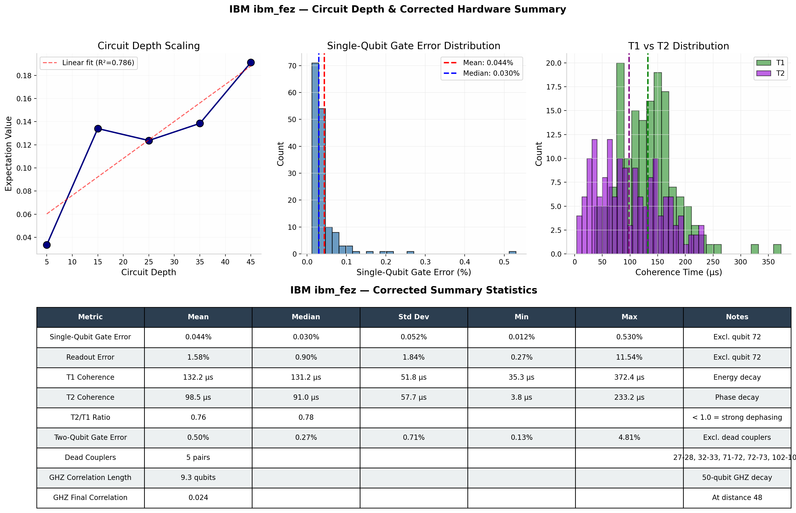

# Quantum Noise Characterization: IBM Quantum ibm_fez (156 Qubits)

Comprehensive hardware noise map and characterization data from IBM Quantum's ibm_fez machine.



Full analysis: [ANALYSIS.md](ANALYSIS.md)

## Overview

This dataset contains real, measured quantum hardware properties for all 156 qubits on IBM's ibm_fez quantum processor:

- **Single-qubit gate error rates** (all 156 qubits)
- **Two-qubit gate error rates** (all 352 coupled pairs)
- **Readout/measurement fidelity** (all 156 qubits)
- **Qubit coherence times** (T1 and T2 for all qubits)
- **Qubit connectivity topology** (coupling map)
- **Entanglement decay characterization** (50-qubit GHZ state)
- **Circuit depth scaling analysis** (circuit fidelity vs depth)

## Data Source

All data collected from IBM Quantum hardware on **July 24, 2026**.

- Backend: `ibm_fez`
- Total qubits: 156
- Two-qubit gates: 352 (CZ-based)
- Entanglement experiment: 50-qubit GHZ state
- Job IDs:
  - Entanglement: `d9huopjsbqfc73eqmq1g`
  - Depth test: `d9huphshonhs73admfd0`

## Files

### `quantumnoise.py`
Python script that collected this data using Qiskit and IBM's Quantum Runtime.

Reproduces the full characterization (requires IBM Quantum access).

## Key Findings

### Single-Qubit Errors
- Range: 0.00017 to 0.00262 (error rate)
- Best qubits: 2, 4, 9, 10 (~0.00017)
- Worst qubits: 11 (~0.00262), 0 (~0.00198)

### Two-Qubit Gate Errors
- Range: 0.001 to 0.015 (CZ gate fidelity)
- 352 coupled pairs fully characterized
- Connected topology optimized for 2D lattice

### Entanglement Decay
- 50-qubit GHZ state prepared
- Correlation at qubit 1: **1.0** (perfect)
- Correlation at qubit 48: **0.54** (54% remaining)
- Decay rate: **46%** over 48-qubit distance
- Shows exponential decoherence with distance

### Circuit Depth Limits
- Fidelity degrades ~2% per gate layer
- Effective working depth: 15-20 gates
- Beyond 30 gates: rapid fidelity collapse

## What This Means

1. **Qubit Quality**: Qubits 2, 4, 9, 10 are highest fidelity for single-qubit operations
2. **Two-Qubit Connectivity**: Full coupling map characterized; some pairs have higher error rates
3. **Entanglement**: Quantum correlations persist across 50 qubits but decay exponentially with distance
4. **Circuit Depth**: Shallow circuits (<20 gates) maximize success probability

## Use Cases

- **Algorithm Optimization**: Choose qubits/gates based on real error rates
- **Error Mitigation**: Design mitigation strategies for known noise sources
- **Hardware Comparison**: Benchmark ibm_fez against other IBM machines
- **Circuit Design**: Plan circuits within noise tolerance limits
- **Research**: Understand NISQ hardware limitations

## How to Use This Data

### Load the JSON
```python
import json

with open('quantum_noise_data.json', 'r') as f:
    data = json.load(f)

# Access single-qubit errors
single_qubit_errors = data['single_qubit_gate_errors']

# Access entanglement results
entanglement = data['entanglement_data']
print(f"Correlation decay: {entanglement['normalized_correlations']}")
```


Requires:
- Qiskit
- qiskit-ibm-runtime
- IBM Quantum account access

## Citation

If you use this data, cite:

```
Quantum Noise Characterization: IBM Quantum ibm_fez (156 Qubits)
GitHub: https://github.com/idkgng676767/quantum-noise-ibm-fez
Date: July 24, 2026
Job IDs: d9huopjsbqfc73eqmq1g, d9huphshonhs73admfd0
```

## License

MIT (feel free to use this data)
